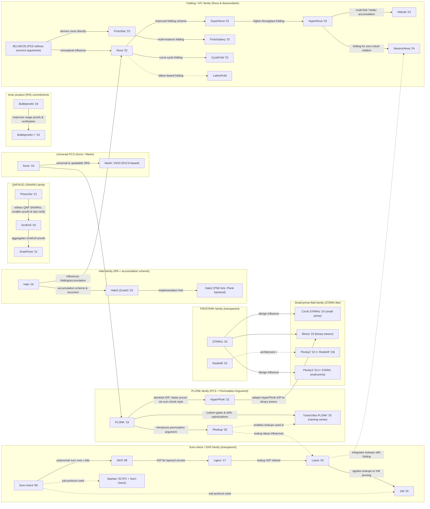

```mermaid

graph LR

  %% ==== QAP/KZG (Pinocchio → Groth16) ====
  subgraph QAP_KZG["QAP/KZG (SNARK) family"]
    Pinocchio["Pinocchio '13"]
    Groth16["Groth16 '16"]
    SnarkPack["SnarkPack '21"]
    Pinocchio -->|refines QAP SNARKs; smaller proofs & fast verify| Groth16
    Groth16 -->|aggregates Groth16 proofs| SnarkPack
  end

  %% ==== Universal PCS (Sonic / Marlin) ====
  subgraph UniversalPCS["Universal PCS (Sonic / Marlin)"]
    Sonic["Sonic '19"]
    Marlin["Marlin '19/20 (R1CS-based)"]
    Sonic -->|universal & updatable SRS| Marlin
  end

  %% ==== PLONK family (Permutation Argument) ====
  subgraph PLONKfam["PLONK family (PCS + Permutation Argument)"]
    PLONK["PLONK '19"]
    PU["Turbo/Ultra PLONK '20 (naming varies)"]
    Hyper["HyperPlonk '22"]
    Plookup["Plookup '20"]
    PLONK -->|introduces permutation argument| Plookup
    PLONK -->|custom gates & arith. optimizations| PU
    Plookup -.->|enables lookups used in| PU
    PLONK -->|plonkish IOP; faster prover via sum-check style| Hyper
  end

  %% ==== IPA / Bulletproofs ====
  subgraph IPA["Inner-product (IPA) commitments"]
    Bulletproofs["Bulletproofs '18"]
    BPpp["Bulletproofs++ '23"]
    Bulletproofs -->|improves range proofs & verification| BPpp
  end

  %% ==== Halo (IPA + accumulation) ====
  subgraph HaloRec["Halo family (IPA + accumulation scheme)"]
    Halo["Halo '19"]
    Halo2Z["Halo2 (Zcash) '20"]
    Halo2PSE["Halo2 (PSE fork, Plonk backend)"]
    Halo -->|accumulation scheme & recursion| Halo2Z
    Halo2Z -->|implementation fork| Halo2PSE
  end

  %% ==== FRI/STARK (transparent) ====
  subgraph STARKsSG["FRI/STARK family (transparent)"]
    STARKs["STARKs '18"]
    Redshift["Redshift '19"]
  end

  %% ==== Small-prime-field variants (STARK-like) ====
  subgraph SmallPrime["Small-prime-field family (STARK-like)"]
    CircleStark["Circle STARKs '24 (small prime)"]
    Binius["Binius '23 (binary towers)"]
    Plonky2["Plonky2 '22 (≈ Redshift '19)"]
    Plonky3["Plonky3 '24 (≈ STARK; small prime)"]

    %% Relationships & influences within small-prime-field variants
    Redshift -.->|architecture ≈| Plonky2
    STARKs -->|design influence| CircleStark
    STARKs -->|design influence| Plonky3
    Hyper -->|adapts HyperPlonk IOP to binary towers| Binius
    STARKs --> Binius
  end

  %% ==== Sum-check / GKR ====
  subgraph GKRSG["Sum-check / GKR family (transparent)"]
    Sumcheck["Sum-check '90"]
    GKR["GKR '08"]
    Ligero["Ligero '17"]
    Lasso["Lasso '24"]
    Jolt["Jolt '24"]
    Spartan["Spartan '20 (PC + Sum-check)"]

    Sumcheck -->|polynomial sum over v bits| GKR
    GKR -->|IOP for layered circuits| Ligero
    Ligero -->|lookup IOP refined| Lasso
    Lasso -->|applies lookups to VM proving| Jolt

    Sumcheck -.->|sub-protocol used| Spartan
    Sumcheck -.->|sub-protocol used| Jolt

    %% lookup cross-influence
    Plookup -.->|lookup ideas influenced| Lasso
  end

  %% ==== Folding / IVC (Nova & descendants) ====
  subgraph Folding["Folding / IVC family (Nova & descendants)"]
    Nova["Nova '22"]
    SuperNova["SuperNova '22"]
    HyperNova["HyperNova '23"]
    Nebula["Nebula '23"]
    ProtoStar["ProtoStar '23"]
    ProtoGalaxy["ProtoGalaxy '23"]
    NeutronNova["NeutronNova '24"]
    CycleFold["CycleFold '23"]
    LatticeFold["LatticeFold"]
    BCLMS["BCLMS'20 (PCD without succinct arguments)"]

    Nova -->|improved folding scheme| SuperNova
    SuperNova -->|higher-throughput folding| HyperNova
    HyperNova -->|multi-fold / better accumulation| Nebula

    %% influences
    Halo -->|influences folding/accumulation| Nova
    BCLMS -->|conceptual influence| Nova
    BCLMS -->|derives more directly| ProtoStar

    ProtoStar -->|multi-instance folding| ProtoGalaxy
    HyperNova -->|folding for zero-check relation| NeutronNova

    Nova -->|curve-cycle folding| CycleFold
    Nova -.->|lattice-based folding| LatticeFold
  end

  %% ==== Cross-family links ====
  Sonic --> PLONK
  Lasso -.->|integrates lookups with folding| NeutronNova
```
