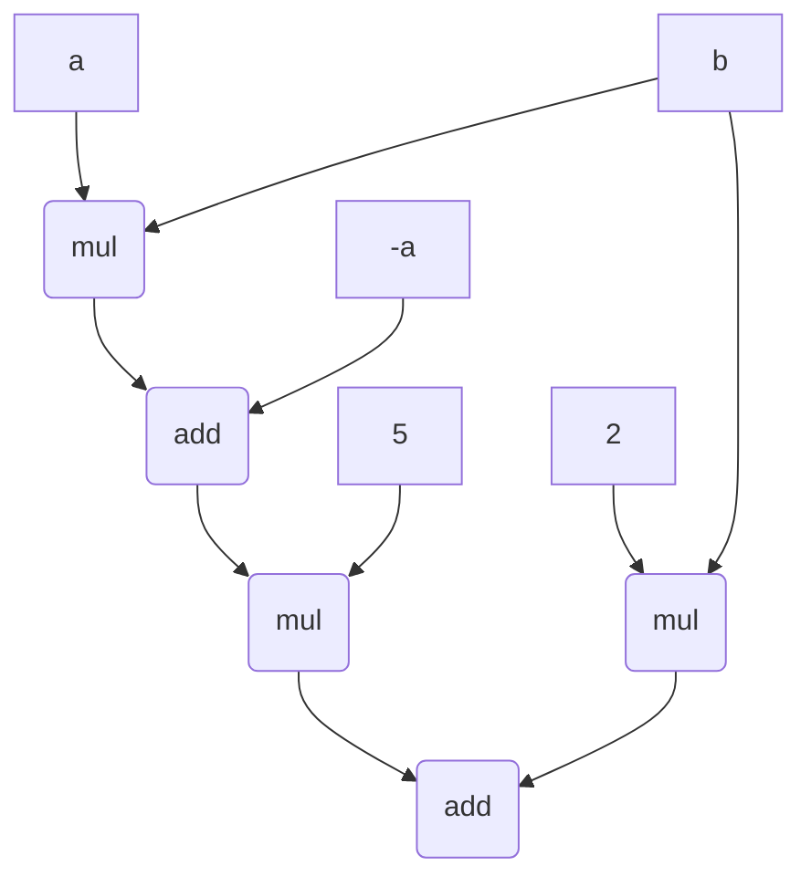

## 1) SNARK とは … ARgument of Knowledge（p.7）を指しますが、なぜ「証明」であるのに “argument” と表現しているのでしょうか？”proof” と “argument” の違いを調べて説明してみましょう。
proofの意味する証明とは「命題が真であること」の証明であるのに対し，argumentの意味する証明とは「命題が真となる知識を知っていること」の証明である．SNARKにおける証明とは後者の意味にあたるため，argumentという語が用いられている．

---
## 2) p.21のKZGにおいて、コミットメントに秘匿性（i.e., ゼロ知識性）を与えるにはどうすれば良いでしょうか？具体的な構築方法を調べて説明してみましょう。
コミットメントにランダム性を加えることでゼロ知識性を達成することができる．例えばコミットメントCを単に
$$
C = g^{f(a)}
$$
と計算するのではなく，群の生成元$h$とランダムなd次多項式$t(a)$を用いて
$$
C = g^{f(a)} h^{t(a)}
$$
と計算することで，完全な秘匿性すなわちゼロ知識性を達成することができる．
[参考]
- https://eprint.iacr.org/2024/854.pdf
- https://www.youtube.com/watch?v=A0oZVEXav24&t=4567s

---
## 3) f(a, b) = 5 * (a * b - a) + 2 * b を PLONK が適用できる形（i.e., 複数の一変量多項式）に途中経過をわかりやすく明示しながら変換してみましょう。

与えら得れた多項式は以下の図のように算術回路で表すことができる。

---

## 4) p.52におけるパブリックインプット・アウトプットの証明をたった1つのKZG評価証明で行うにはどうすれば良いか、調べて説明してみましょう。
→ ヒント: ゼロテスト（p.53~p.54）を用いる。  
パブリックインプット・アウトプットの証明に対して，スライドp53,54で行われているゲート制約に対するbatch proofを同様に適用する．  
回路のインプット(アウトプット)$IO$のうち，パブリックなものの値を$PIO_{value} = \{value_j\} $, 対応するグローバルインデックスを$PIO_{index} = \{ \omega_{j}` \}$と置く. ここで，次の多項式$v$ を多項式補完によって生成する 
$$
v( \omega_{j}' ) = value_j
$$
3つのwitness-polynomialのうち、L(x)のパブリックインプット・アウトプットの証明について考えると，L(x)がパブリックインプット・アウトプットを正しくエンコードしているとき，$L(\omega_{j}') = value_j$である．
よって，
$$
\forall \omega_{j}' \in PIO_{index}, L(\omega_{j}') = v(\omega_{j}') 
$$
すなわち，
$$
\forall \omega_{j}' \in PIO_{index}, L(\omega_{j}') - v(\omega_{j}') = 0
$$
である．よって，$L(x)-v(x)$ は多項式$I(x) = \prod_{PIO_{index}} (x-\omega_{j}')$によって割り切ることができる．すなわち，
$$
L(x) - v(x) = I(x) q(x)
$$  
なるq(x)が存在する．
あとは，$f(x) = L(x) - v(x)$, $Z(x) = I(x)$と考えて，p53-54と同様の証明を行えば，L(x)に関するパブリックインプット・アウトプットの証明は完了する．
以上と同様のことをR, Oに対しても行うことで，回路全体のパブリックインプット・アウトプットの証明が完了する．      
[参考]  
- https://www.youtube.com/watch?v=A0oZVEXav24&t=4567s
- https://youtu.be/vxyoPM2m7Yg?si=QQ9jJ0XlCnnYlIbL
- https://arnaucube.com/blog/kzg-batch-proof.html 

---