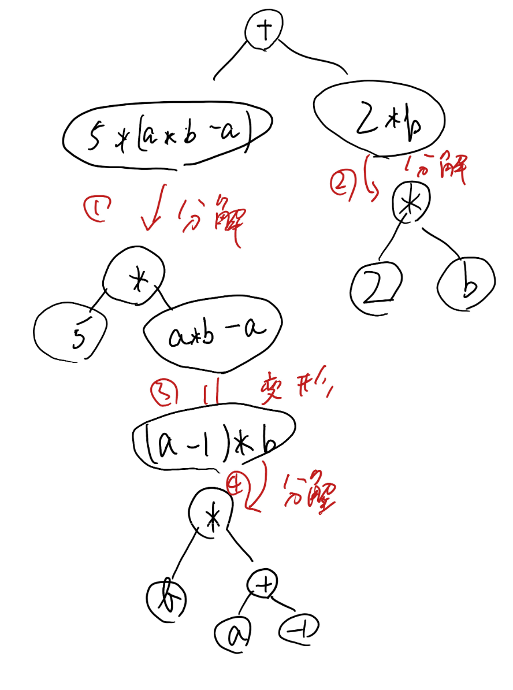
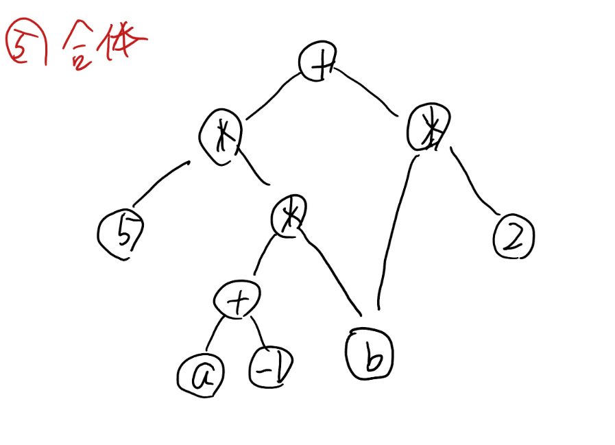

SNARK とは … ARgument of Knowledge（p.7）を指しますが、なぜ「証明」であるのに “argument” と表現しているのでしょうか？

検証者が有限の計算資源しか持たないと仮定しているから。もし検証者の計算資源が無限であるならば、それを棄却することができてしまう、といったニュアンスを含めたかったから。

p.21のKZGにおいて、コミットメントに秘匿性（i.e., ゼロ知識性）を与えるにはどうすれば良いでしょうか？具体的な構築方法を調べて説明してみましょう。

毎回異なるランダム値をべき乗することで、コミットメントに秘匿性を与えることができる。C' = C * g^r のようにすれば、離散対数問題の困難性により、C から C' を元に戻すことができないため、秘匿性が保たれる。

f(a, b) = 5 * (a * b - a) + 2 * b を PLONK が適用できる形（i.e., 複数の一変量多項式）に途中経過をわかりやすく明示しながら変換してみましょう。

画像の通りに分解を進めていくと、以下の画像の通りになった。

p.52におけるパブリックインプット・アウトプットの証明をたった1つのKZG評価証明で行うにはどうすれば良いか、調べて説明してみましょう。
→ ヒント: ゼロテスト（p.53~p.54）を用いる。

PubIn, Outの各価について証明する場合、それらのすべてを解にとった多項式でゼロテストを行うことで、1つの証明にまとめることができる。

具体的には、$Z(x) = \prod_{i=1}^k (x - x_i)$ を用意し、$f(x) - g(x) = Z(x) \cdot h(x)$ であることをKZG評価証明で示せば、すべてのパブリックインプット・アウトプットの正しさを1つの証明でまとめて検証できる。

